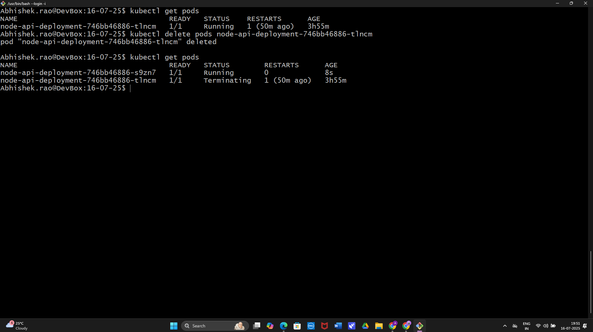
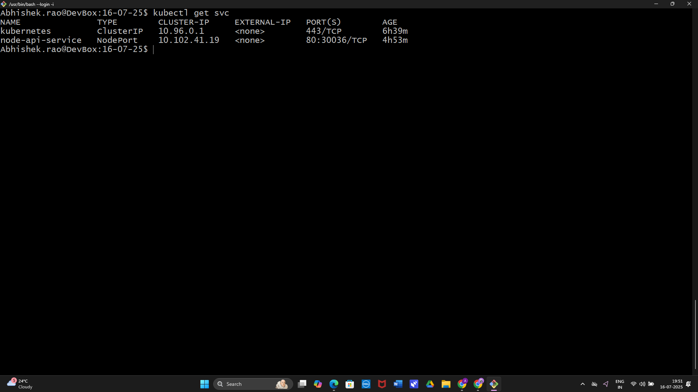
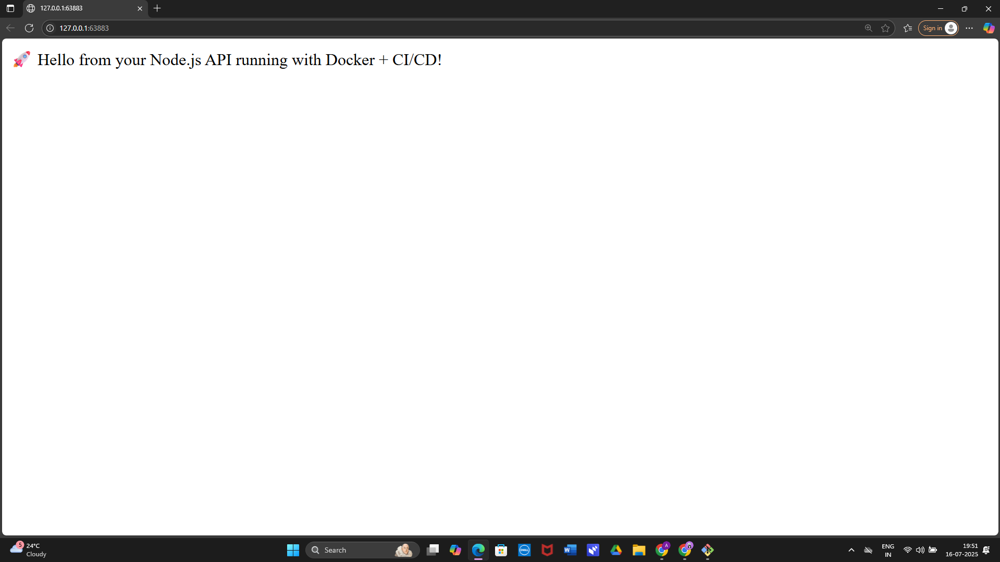

# 🚀 Node.js API Kubernetes Deployment (CI/CD with GitHub Actions)

This project demonstrates a complete CI/CD pipeline to deploy a containerized Node.js API onto a Kubernetes cluster using GitHub Actions and Docker.

---

## 🛠️ Tech Stack
- **Node.js**
- **Docker**
- **GitHub Actions**
- **Kubernetes (Minikube)**
- **DockerHub**

---

## ⚙️ CI/CD Pipeline Flow

1. Developer pushes code to GitHub
2. GitHub Actions triggers pipeline:
   - Lints and builds the Docker image
   - Pushes the image to DockerHub
3. Kubernetes Deployment YAMLs are applied manually/minikube for now

---

## 📦 Files Structure

- `Dockerfile` – Container setup
- `.github/workflows/main.yml` – GitHub Actions pipeline
- `k8s/` – Contains `deployment.yaml`, `service.yaml`

---

## 📦 DockerHub Link
[DockerHub Repo](https://hub.docker.com/repository/docker/abhidochub123/node-api-app)

---

## 📄 How to Deploy

```bash
# Build locally
docker build -t node-api .

# Run locally
docker run -p 3000:3000 node-api

# Deploy to K8s (Minikube)
kubectl apply -f k8s/deployment.yaml
kubectl apply -f k8s/service.yaml
```


## 📸 Screenshots

### ✅ 1. Pod Running


### ✅ 2. Service Exposed


### ✅ 3. App in Browser


